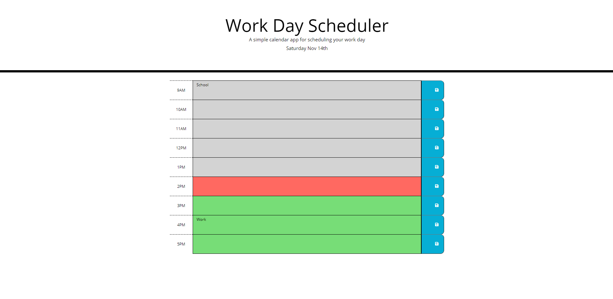

# work-day-planner
When you open this page it displays the current date with standard business hours which when in the future are green, when in the past are gray, and when in the current hour slot are red. You can enter information into each time slot and hit the save button which saves that information to the local storage so if you open the page later on it will still have your tasks. 
Availible at [Planner](https://marshallb98.github.io/work-day-planner/)
